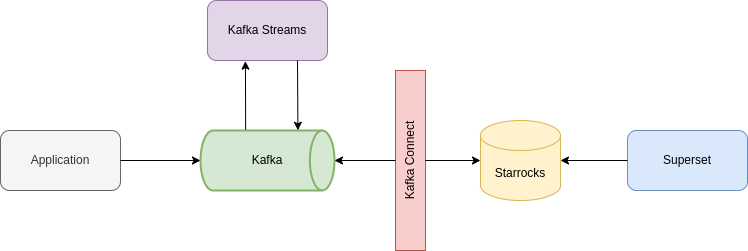
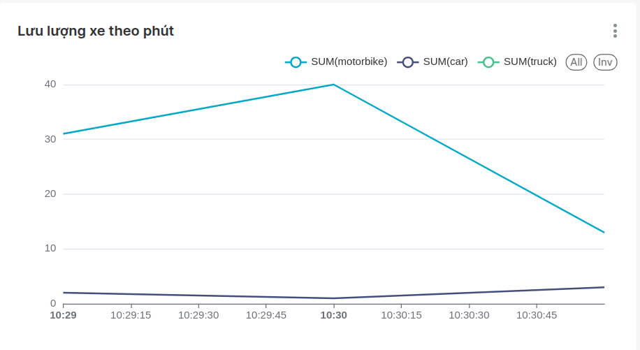

# Real-Time Analytics With StarRocks, Kafka Streams, Kafka Connect, Superset

## Build

- Build kafka streams: `mvn clean install`

- Build docker-compose: `docker-compose build`

## Up docker

- `docker-compose up -d`

## Usage

- Link superset: [localhost:25678](http://localhost:25678)
- User: `admin`
- Password: `admin`

## Chart

